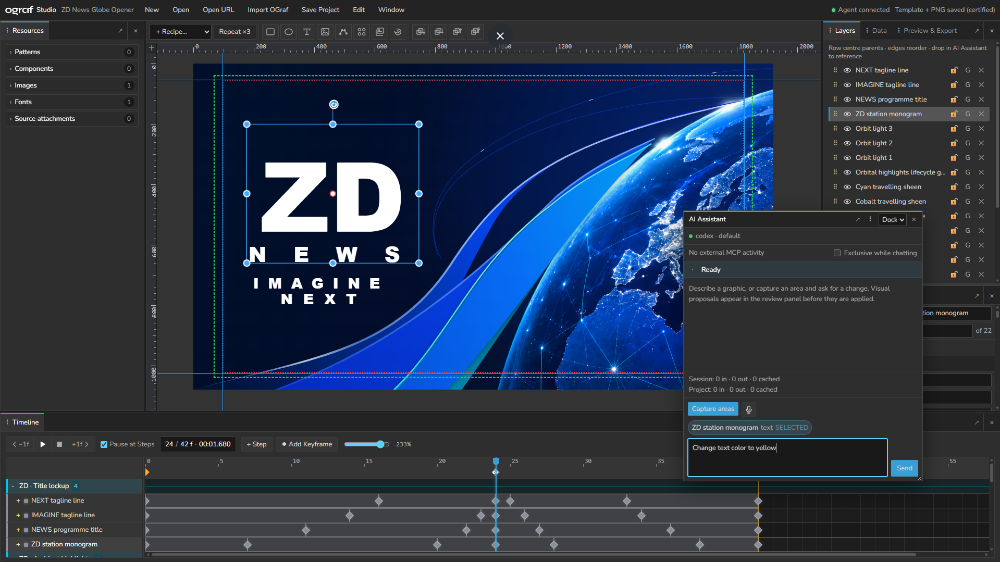

# OGraf Studio



A browser-based visual editor for creating EBU OGraf-compatible HTML5 broadcast graphics such as
lower thirds, scoreboards, tickers, full-frame graphics, and reusable data-driven templates.

The project combines a React/Vite editor, a deterministic OGraf runtime, validation and export
packages, and an optional local MCP authoring server for AI-assisted workflows.

## New in OGraf Studio 0.13

- Reliable Lottie Canvas rendering across resize, hidden/detached setup, mattes, gradients and
  rounded artwork, with explicit embedded-image/font readiness and actionable load failures.
- Correct nonzero Lottie in-points, a shared realtime clock, byte-repeatable non-realtime seeks and
  stronger exported-runtime certification over every expected Canvas.
- Launch, New, open/import and template replacement always return to frame 0 with Start selected;
  initial placement edits preserve still-static lifecycle poses instead of creating accidental
  easing.
- Rectangles and ellipses begin at 200 × 200, while Properties presents common visual controls
  before advanced authoring metadata.
- Ctrl/Cmd+D, Edit → Duplicate and canvas Duplicate create an exact-position copy with fresh layer,
  animation, relationship, component-instance and bound-field identities. Paste keeps its offset.
- Updated MCP capabilities, Lottie inspection, authoring skill and in-app AI guidance.
- Refreshed single-file Windows, macOS and Linux executables, with the export runtime embedded.

See [the complete 0.13 release notes](docs/releases/0.13.md) and
[download the release](https://github.com/zerodensity/ograf-studio/releases/tag/v0.13).

## Highlights

- **Edit as path** turns rectangles, rounded rectangles and ellipses into editable points and
  curves. Drag anchors/handles, add/remove points, smooth corners and nudge with the keyboard.
  Changes apply across the animation; each drag is undoable. Existing SVG paths support the same
  controls, and MCP exposes the corresponding geometry operations.

- WYSIWYG canvas with layers, grouping, guides, rulers, snapping, clipping, and responsive layout
  aids.
- Compact SVG element tools provide distinct Rectangle, Ellipse, Text, Image, Path, Image Sequence,
  and Lottie icons with accessible labels and tooltips.
- Ordinary newly added rectangles, ellipses, text, images, paths, sequences, and Lottie layers start
  at full alpha across Start, Step, and End until the author explicitly animates opacity.
- Launch, New, and project/template loading start at frame 0 with the Start lifecycle state selected.
  Placing a fresh object there updates its still-static lifecycle poses instead of creating an
  accidental entrance tween.
- Rectangles and ellipses start at 200 × 200, so their first appearance is a square or circle;
  width and height remain independently editable afterward.
- Infinite node-graph-style canvas camera with hidden native scrollbars, unbounded middle-button
  panning, plain-wheel pointer-anchored zoom, and camera-aware rulers/guides in Edit and OGraf
  Preview.
- Layers retain their true paint-order list while child names indent by complete parent depth.
  Dragging over a row centre assigns its parent; upper and lower row-edge zones continue to reorder
  before or after without conflating hierarchy and z-order.
- Properties exposes that same canonical paint order as an editable, one-based **Z order** value:
  `1` is back and the current layer count is front. Typing a value reorders the real layer rather
  than creating a separate 3D depth property.
- Selected-layer Properties puts common visual work first: name/Z, transform/alpha/easing, and
  element content/appearance precede Brand Kit, effects, compositing, layout, bindings, and semantics.
- Ctrl/Cmd+D duplicates the selected object or complete group at exactly the same position and
  selects the copy beside its source in paint order. Each command is one undo step. Edit and the
  canvas context menu expose the same command; Paste remains offset.
- The canvas toolbar adds icon actions for Send to Back, Send Backward, Bring Forward, and Bring to
  Front. They support single or multi-layer selections and preserve selected-layer relative order.
- EBU R 95 16:9 action-safe and title/graphics-safe overlays with exact 3.5% and 5% per-axis
  margins for HD and UHD rasters, shared by canvas guides, broadcast QA, and MCP inspection/lint.
- New compositions start with an opaque black background and **Outside canvas · 20% gray**
  enabled. The solid editor-only `#333333` surround never enters captures or exported graphics;
  both background transparency and the outside fill remain editable Canvas Layout choices.
- Canvas Layout also offers an editor-only **Big Buck Bunny** presentation video. The muted 30-second
  HTML video loops behind the authoring canvas, appears only through transparent composition
  pixels, and never enters capture/certification/export. It requires internet access to the CDN.
- Independent per-property animation tracks, per-key easing and curves, local loops, and freely
  movable OGraf lifecycle Steps.
- Timeline transport has explicit **−1f / +1f** controls. With the Timeline focused, Left/Right
  Arrow pauses playback and steps one frame; Alt+Left/Right nudges focused keys or lifecycle markers.
  Text/numeric inputs, zoom sliders and the resize divider retain their native arrow behavior.
- Tracks show clear spans and key markers. Hold **Alt** while hovering for duration, easing and
  marker details; layer names and ruler values remain visible.
- Ctrl/Cmd-click selects layer/property keys across timeline rows and Shift-click selects a same-row
  range; dragging or Alt+Arrow nudging any selected key moves the complete selection while preserving spacing
  and collisions.
- The Timeline divider between layer/property names and keyframe tracks is draggable, keyboard
  adjustable, double-click resettable, and persisted locally.
- Timeline parent layers use one fixed summary colour, while Position X/Y, Width, Height, Rotation,
  Alpha, origins, text stroke, blur, shadow values, and gradient-stop tracks use a stable semantic
  colour palette across every object and project.
- Expanded timeline layers show only properties that change, have an authored non-lifecycle key, or
  own a local loop. **All** temporarily reveals every compatible property, while **+ Property**
  reveals/selects a static property so its first authored key can be added without permanent clutter.
- Timeline `∞` badges identify the Step where each layer-local loop activates, on both the global
  lifecycle marker and the matching layer key diamond.
- Data fields with multiple independent property bindings per layer for text, images, colors, and
  structured gradients.
- Composition-local layer blend modes with an isolated transparent root, so blending is portable
  between the editor, browser capture, realtime playback, and deterministic offline rendering
  without accidentally blending against a controller's external video bed.
- Reality Hub-ready GDD field metadata with descriptions, select labels, file hints, scalar
  constraints, integer/duration/percentage controls, and select-multiple values.
- Recursive GDD objects and arrays, including bounded runtime collections that expand one grouped
  item prototype from Reality Hub data with explicit spacing, capacity, truncation, nested value
  paths, deterministic updates, and non-realtime seeking.
- Reusable authoring components that snapshot selected layers and bound fields, then insert fresh
  independent or explicitly refreshable linked instances without adding a proprietary runtime
  dependency.
- Compact Resources tree with counted, collapsible Brand Kit, Components, Images, Fonts, and Source
  branches; individual item editors expand only when needed.
- Shared Zero Density/RealityHub chrome with locally bundled Nunito plus one monospace diagnostics
  family, 14 px / 13 px editor text tiers, charcoal surfaces, cyan focus/active accents, and flat
  0/2 px geometry. Authored graphic typography and pixels remain independent and unchanged.
- RealityHub-style numeric scrubbing on every enabled number field: hover for the instruction popup,
  drag left/right by the field step, hold Shift for 10× or Alt for 0.1×, and click to select the
  value for ordinary typing.
- Brand Kits with typed color, typography, and geometry tokens plus News, Sports, Entertainment,
  and Documentary style packs; copied token values remain editable and materialize into standard
  properties so exported graphics never require OGraf Studio at playout time.
- Broadcast text outlines with editable stroke colour and independently animated width, rendered
  behind the glyph fill consistently in the editor, browser capture, SVG diagnostics, and export.
- Text **Fit to width** sizing grows or shrinks glyphs to the largest proportional font size that
  fills a fixed text box without overflowing either axis, and responds to data, animated box size,
  stroke width, and packaged-font loading in editor preview and exported runtime.
- Text **Squeeze** sizing deliberately scales glyph width and height independently to fill the
  authored box, so non-proportional layer resizing can create condensed, expanded, tall, or flattened
  typography consistently in preview and export.
- Semantic lower-third, bug/DOG, clipped ticker, scoreboard, clock, and repeater recipes for fast
  AI/human authoring while keeping every result editable through normal layers, fields, groups, and
  tracks.
- Self-contained Lottie JSON layers with deterministic loop playback in editor preview, OGraf
  realtime playback, and non-realtime `goToTime()` seeking.
- Start, pausable Step, and End lifecycle preview using the same compiled timeline as export.
- Canvas selection outlines and Moveable controls hide during Timeline playback without clearing the
  selection, then return when playback pauses or stops.
- Ctrl/Cmd+A selects every authored layer in the active composition instead of selecting webpage
  text; editable inputs retain their native Select All behavior.
- Exact pre-save and pre-export OGraf certification against the packaged manifest, module, API, and
  realtime/non-realtime lifecycle behavior.
- Best-effort conversion of existing OGraf packages into editable projects with an explicit recovery
  and loss report.
- Optional localhost MCP server with revisioned scene/timeline operations, validation, visual
  capture, certification, save, and export tools.
- One consolidated `ograf_apply_operations` entry point for committed apply, browser-free dry-run,
  rendered preview, and human Accept/Reject proposal modes.
- Compact capability-section discovery and apply/dry-run `includeReview` output for fewer AI model
  round trips without weakening revision checks or certification.

## File types

| File                      | Purpose                             | How to open it                                                                                  |
| ------------------------- | ----------------------------------- | ----------------------------------------------------------------------------------------------- |
| `.ogs`                    | Editable OGraf Studio source        | **Open Project**                                                                                |
| Remote `.ogs` URL         | Public/CORS-enabled editable source | **Open URL**                                                                                    |
| `.ograf.zip`              | Certified playout package           | **Import OGraf** for best-effort editable conversion, or extract it for an OGraf player/devtool |
| Loose OGraf package files | Manifest, `main.js`, and resources  | Select them together with **Import OGraf**                                                      |
| SVG and raster images     | Reusable image assets               | **Add Image** above the canvas, or drop files onto the canvas                                   |
| Lottie `.json`            | Looping vector animation layer      | **+ Lottie JSON** above the canvas                                                              |

An `.ogs` file is not an OGraf manifest and should not be opened directly in an OGraf playout
tool. A `.ograf.zip` is the deployable output, but arbitrary third-party JavaScript cannot always be
reconstructed as editable layers. The import report lists everything recovered, defaulted, or lost.

Opening remains backward-compatible with legacy `.ogeproj` and `.ogeproj.json` source files. New
browser downloads, picker saves, reference templates, and MCP saves use `.ogs` exclusively.

### Remote project URLs

Use **Open URL** to download editable `.ogs` source from an absolute HTTP or HTTPS URL. OGraf
Studio sends no credentials, follows only HTTP(S) redirects, limits the response to 32 MiB, parses
and validates the source before loading, and asks before replacing the current project. The remote
server must allow browser CORS access.

A public GitHub repository is suitable storage. Use the raw-file URL, not the normal `/blob/` page:

```text
https://raw.githubusercontent.com/OWNER/REPOSITORY/main/path/project.ogs
```

Use a commit SHA instead of `main` when the URL must identify an immutable project revision. Public
repositories expose the complete `.ogs`, including embedded image/font data and field defaults;
do not store private content or credentials in them. Private GitHub raw URLs are not supported by
the credential-free browser loader, although a CORS-enabled time-limited signed URL can work.

### Adding and replacing images

Click **Add Image** above the canvas to choose files or pick a thumbnail from the template's
existing images. You can also drop image files directly onto the canvas. Each image becomes a
named layer at its original proportions; large images fit within 80% of the canvas and smaller
images retain their native size. Multiple files are added together with a slight offset.

Select an image layer to see its preview and **Replace image** near the top of Properties.
Replacement preserves the layer's size, position, animation, effects and bindings. Bound data can
still override the source during playback. **Source URL** remains available for linked images.
Resources → Images also offers **Add to canvas** on each expanded image.

Cancelling or failing an import leaves no empty layer. Undo restores the image and its resource
together. PNG, JPEG, WebP, GIF, AVIF and standalone SVG files are supported when the browser can
decode them; GIF timing retains the existing runtime behavior. SVGs with companion files use the
bundle workflow below.

### SVG and Photoshop exports

Use **Resources → Import Image/SVG Bundle** and select one SVG together with its companion CSS,
linked images, and local font files. OGraf Studio injects the CSS into the SVG, replaces selected
relative image/font URLs with data URIs, removes the external XML stylesheet reference, and
registers selected fonts as project font assets. Any unresolved relative URL is reported in the
Resources panel. The result remains one portable image asset; Photoshop's rasterized content and
arbitrary SVG structure are not decomposed into independently editable studio layers.

MCP clients can perform the same portable import through `ograf_import_svg_bundle`, or ingest one
workspace-confined file through `ograf_import_asset`. Both tools enforce file and aggregate payload
limits before committing one revision-checked asset transaction.

### Lottie animations

Use **+ Lottie JSON** above the canvas, or replace the JSON from a selected Lottie layer's
Properties. The first supported profile is intentionally deterministic and portable:

- the Bodymovin/Lottie JSON is embedded in the editable project and exported OGraf module;
- playback loops continuously, with an editable non-negative speed multiplier;
- editor scrubbing and non-realtime `goToTime()` derive the exact Lottie frame from composition
  time; realtime playback uses the same absolute-time frame calculation;
- `load()` predecodes embedded images and waits for fonts and the initial Canvas frame; failures
  return an error instead of allowing a blank graphic to pass as ready;
- a positive adapter-owned backing Canvas avoids zero-sized matte buffers and unsafe player resize
  calls. CSS reframes that backing when the layer box changes;
- nonzero source in-points are mapped to the player's relative frame API, and changed non-realtime
  seeks rebuild the player for byte-repeatable output;
- the self-hosted light canvas player is bundled into `main.js`, with no CDN dependency;
- expressions are disabled; external image/font paths, segmented documents, undecodable image
  payloads, and luma mattes are rejected. Export images inside the JSON as data URIs, use alpha
  mattes, or convert artwork to shapes/glyphs.

A small compatible animation is included at `examples/lottie/pulse.json`. The pinned
[Lottie reliability benchmark](docs/benchmarks/2026-09-04-lottie-reliability.md) separates light/full
Canvas fidelity, repeatability, and exported-runtime evidence. Marker control, one-shot playback,
dynamic Lottie text/data binding, separate image folders, renderer selection, and target-device
certification remain deferred.

## Requirements

- Node.js 22 or newer
- npm
- A modern Chromium-based browser is recommended for the File System Access API; other browsers use
  download/upload fallbacks.

## Quick start

From the repository root:

```powershell
cd C:\works\zd_ograf_editor
npm install
npm run dev
```

Open `http://localhost:5173/`.

The root development command builds the runtime bundle before starting Vite. If you change
`packages/ograf-runtime/src` while the editor is already running, rebuild it explicitly:

```powershell
npm run build --workspace @ograf-editor/ograf-runtime
```

## Run the MCP server

Start the editor first, then use a second terminal:

```powershell
cd C:\works\zd_ograf_editor
npm run mcp:start
```

Endpoints:

- MCP: `http://127.0.0.1:4318/mcp`
- Editor bridge: `ws://127.0.0.1:4318/editor`
- Health: `http://127.0.0.1:4318/health`

To start the editor and MCP server together as hidden background processes, run:

```powershell
npm run start:all
```

The command skips a service that is already online, waits up to 45 seconds for both endpoints, and
writes stdout/stderr logs under `.logs`.

### Single-executable server

The optional standalone distributions serve the production editor, MCP endpoint, editor WebSocket,
health endpoint, fonts, icons, and application assets from one headless executable per operating
system and architecture. They do not replace or change the normal `npm run dev`,
`npm run mcp:start`, or `npm run start:all` workflows.

Install [Bun](https://bun.sh/) on the build machine, then run:

```powershell
npm run server:package
```

This creates the Windows x64 executable. Build the complete release matrix with:

```powershell
npm run server:package:all
```

The matrix produces:

| Operating system | Architecture  | Artifact                        |
| ---------------- | ------------- | ------------------------------- |
| Windows          | x64           | `OGrafStudioServer.exe`         |
| macOS            | Intel x64     | `OGrafStudioServer-macos-x64`   |
| macOS            | Apple Silicon | `OGrafStudioServer-macos-arm64` |
| Linux            | x64           | `OGrafStudioServer-linux-x64`   |
| Linux            | ARM64         | `OGrafStudioServer-linux-arm64` |

Bun, Node.js, npm, and the source tree are not needed on destination machines. Start the applicable
file directly and open the reported URL in any normal browser:

```powershell
OGrafStudioServer.exe
OGrafStudioServer.exe --open
OGrafStudioServer.exe --port 4400 --workspace "D:\OGraf Projects"
```

The standalone server binds to `127.0.0.1` only. Its default writable
workspace is `Documents\OGraf Studio\Projects`; `--workspace` and the existing
`OGRAF_WORKSPACE_ROOT` environment variable can override it. `--open` launches the system browser,
while the default remains suitable for a console or background process. Run
`OGrafStudioServer.exe --help` for the complete option list.

For source-level testing of the same combined host, use `npm run server:start`. This command requires
Bun because it runs the TypeScript entry point directly; only the generated executable is
self-contained.

Linux users must make the downloaded file executable with `chmod +x`. The macOS artifacts are raw,
unsigned command-line executables; they require code signing and notarization before broad external
distribution. The Windows executable contains Zero Density product/version metadata and the OGS
icon; headless macOS/Linux executables do not have desktop application icons.

The source-level `npm run mcp:start` server also binds only to loopback, but defaults its writable
workspace to the repository root. Set `OGRAF_WORKSPACE_ROOT` before starting that command to use a
different confined workspace. Set `OGRAF_MCP_PORT` to change port `4318`, and set the editor's
`VITE_OGRAF_AGENT_BRIDGE_URL` to the matching WebSocket URL when changing the port.

## In-app AI chat (BYOK)

OGraf Studio includes a **Chat** tab beside **Layers** in the left sidebar. The model loop runs in
the local server process and drives the same canonical, revision-checked tool records as MCP. The
browser receives only redacted chat/tool/usage events: provider credentials never enter renderer
JavaScript, WebSocket frames, project files, or local usage storage.

Configure the server before starting `npm run mcp:start`:

```powershell
$env:OGRAF_AGENT_PROVIDER = "anthropic" # or "openai-compatible"
$env:OGRAF_AGENT_BASE_URL = "https://api.anthropic.com"
$env:OGRAF_AGENT_MODEL = "your-model-id"
npm run agent:credential
npm run mcp:start
```

`agent:credential` prompts without echo and stores the secret as
`OGraf Studio/<provider>` in Windows Credential Manager. For managed or air-gapped machines, set
`OGRAF_AGENT_API_KEY` in the server environment instead; it is a fallback and is never persisted by
Studio. `OGRAF_AGENT_BASE_URL` is required so facilities can use an internal gateway or self-hosted
OpenAI-compatible endpoint. It may be an API root ending in `/v1` or a complete chat-completions URL.

Optional server-only settings are `OGRAF_AGENT_CHEAP_MODEL` for routine rename/property/key work,
`OGRAF_AGENT_EFFORT` (`low`, `medium`, or `high`), `OGRAF_AGENT_ORGANIZATION`,
`OGRAF_AGENT_PROJECT`, `OGRAF_AGENT_CREDENTIAL_TARGET`, and `OGRAF_AGENT_TIMEOUT_MS` (provider wait
timeout, default 120000 ms). Restart the server after changing them.
The panel reports per-message, per-session, and cumulative-per-project token usage; cumulative usage
is browser-local metadata keyed by project ID and is deliberately excluded from `.ogs`.
It also reports recent external MCP activity. An optional session-local exclusive toggle prevents
the in-app and external agents from authoring at the same time; optimistic revision checks remain
the normal default when that toggle is off.

While a turn is active, Chat keeps an always-visible progress strip above the transcript with an
animated activity indicator, provider/model wait phase, tool summary, model round, and elapsed time.
Long waits escalate to explicit "still working" guidance. Disconnects and provider timeouts end the
busy state with an actionable error instead of leaving Cancel visible indefinitely.

Chat conversations are isolated by project ID, retain at most 96,000 characters of recent atomic
history, and cap individual tool-result payloads at 16,000 characters. Opening or creating another
project therefore starts a fresh conversation. If Anthropic still rejects the first request as too
long, Studio automatically retries that turn once with fresh project conversation history.

Current canvas, Layers-pane, and Timeline selection automatically appears in Chat as one or more
**selected** reference chips. The primary layer's selected property/key is included when applicable,
and those references update immediately as selection changes. Layers may still be dragged into Chat
to add removable references outside the current selection. Explicit chips supply stable IDs, names,
and element types for prompts such as “change the color to green.”

The in-app model receives a reduced 14-tool authoring surface. Save, export, certification, project
reset/open, and imports remain explicit Studio UI actions. Visually consequential tool batches still
appear in the existing **Accept/Reject** review panel. The generated in-app knowledge prompt is a
projection of `skills/ograf-authoring`; `npm run prompt:generate` updates it and `npm run verify`
rejects drift.

## Claude Desktop configuration on Windows

The server uses Streamable HTTP, while `claude_desktop_config.json` launches local stdio processes.
Use `mcp-remote` as a local compatibility bridge.

1. Start both `npm run dev` and `npm run mcp:start`.
2. Open `%APPDATA%\Claude\claude_desktop_config.json`.
3. Merge this entry into the existing `mcpServers` object:

```json
{
  "mcpServers": {
    "ograf-studio": {
      "command": "npx",
      "args": ["-y", "mcp-remote", "http://127.0.0.1:4318/mcp", "--allow-http"]
    }
  }
}
```

4. Fully quit and reopen Claude Desktop.

`--allow-http` is appropriate here only because the endpoint is loopback-only. Do not use this
configuration for a server exposed on another machine or network. `npx` downloads the compatibility
bridge on first use, so Node.js and network access are required for that first launch.

## Using the `ograf-authoring` skill

The repository includes a reusable skill at
[`skills/ograf-authoring`](skills/ograf-authoring). It teaches a skill-aware agent how to operate the
editor through MCP while preserving OGraf lifecycle, animation, validation, and certification
rules. The skill does not contain the editor or server; start `npm run dev` and `npm run mcp:start`
before using it.

For Codex, install the complete `ograf-authoring` folder in one of the standard discovery locations:

- repository scope: `.agents/skills/ograf-authoring`;
- user scope on Windows: `%USERPROFILE%\.agents\skills\ograf-authoring`.

Copy or link the folder rather than only `SKILL.md`, because its `references` and
`agents/openai.yaml` files provide the detailed workflows and MCP dependency. The tracked
[`ograf-authoring.zip`](skills/ograf-authoring/ograf-authoring.zip) contains the portable
instruction bundle for clients that accept a skill archive. If a newly installed or updated skill
does not appear, restart the client.

Invoke it explicitly in Codex with a prompt such as:

```text
$ograf-authoring create an editable 90-frame lower third with name and role fields,
inspect its entrance and exit animation, certify it, and save the .ogs source.
```

The expected workflow is:

1. Start the editor and MCP server.
2. Invoke `$ograf-authoring` and describe the visual result, data fields, timing, and requested
   output.
3. Let the agent inspect capabilities and use semantic scene queries before it edits anything.
4. Review visual dry runs or explicit in-editor proposals before accepting consequential changes.
5. Use deterministic design/motion QA, PNG capture, and animation strips to inspect the result.
6. Approve save/export only after validation and exact OGraf certification pass.

The skill is intended for authoring graphics through the running editor. To change the editor's
React/TypeScript source code, work on the repository normally and finish with `npm run verify`.

### Vibe coding with and without the skill

Here, _vibe coding_ means describing the desired graphic in natural language and iterating on the
result instead of manually constructing every layer, field, and keyframe.

| Area                | Without `ograf-authoring`                                                                                 | With `ograf-authoring`                                                                                        |
| ------------------- | --------------------------------------------------------------------------------------------------------- | ------------------------------------------------------------------------------------------------------------- |
| Starting point      | The agent must rediscover the editor, MCP tools, and OGraf rules from the repository or prompt.           | The agent begins with the editor-specific workflow, tool boundaries, and OGraf invariants.                    |
| Project edits       | Ad-hoc tool calls can use stale IDs or overwrite concurrent human edits.                                  | Reads first, preserves stable IDs, supplies `expectedRevision`, and deliberately rebases conflicts.           |
| Animation           | Natural-language requests may accidentally mix lifecycle Steps with layer/property keys.                  | Keeps Start/Step/End control points separate from each layer's independent property tracks and loops.         |
| Repeated graphics   | Repeated cells and assets may be recreated manually and inconsistently.                                   | Uses semantic repeaters or lower-level duplication, registered assets, staggered tracks, and timeline groups. |
| Visual checking     | Often stops after code generation, a build, or one subjective browser view.                               | Uses operation previews, design/motion QA, frame strips, measurement, and representative data values.         |
| Human control       | A visually consequential agent edit may be applied before anyone sees it.                                 | Can present a rendered, revision-checked proposal in OGraf Studio for explicit Accept or Reject.              |
| OGraf compatibility | A valid-looking project or successful build may be mistaken for compliant output.                         | Treats validation and exact manifest/module/lifecycle certification as separate mandatory gates.              |
| Save and export     | The agent may write raw JSON or assemble a ZIP outside the editor's safety boundary.                      | Uses certified `.ogs` save and `.ograf.zip` export tools only when the user requests file output.             |
| Undo and recovery   | Changes may require manual cleanup when a long prompt partly succeeds.                                    | Coherent atomic batches become meaningful agent undo units, with dry runs for risky changes.                  |
| Speed profile       | Fast for rough experiments, but more prompt detail and rework are usually needed for production graphics. | Adds a short inspect/verify overhead, then reduces rediscovery, inconsistent edits, and compliance rework.    |
| Best fit            | Exploring ideas, changing editor source code, or using an unsupported one-off workflow.                   | Repeatable, editable, data-driven OGraf authoring intended for certification and playout.                     |

The skill improves process reliability, not model creativity. The visual concept still comes from
the user and agent; the skill makes the route from that concept to an editable, inspected, certified
OGraf result more deterministic.

## Can the editor run without a backend?

Yes. The visual editor is a client-side application and can author, preview, import, certify, save
`.ogs`, and export `.ograf.zip` files without the MCP server. Autosave uses browser storage, and
explicit saves use the browser file picker or downloads.

Without the MCP server you lose:

- external agent/tool access;
- revision-checked MCP mutations, agent undo/redo, and temporary MCP sessions;
- MCP-requested PNG captures, contact sheets, and text measurements;
- agent-controlled certified save/export to a workspace path.

Normal visual editing and browser-driven save/export remain available. A production build can be
served as static files; the MCP server is an optional authoring companion, not an application
backend.

## Verification

Run the complete local gate before publishing changes:

```powershell
npm run verify
```

It checks generated MCP contract drift, formatting, lint, every workspace typecheck, all tests, the
OGraf runtime bundle, and the editor production build. `npm test` also prebuilds the ignored runtime
bundle so tests work in a fresh clone.

## Repository layout

- `apps/editor` — React/Vite visual editor.
- `apps/mcp-server` — localhost Streamable HTTP MCP server and editor bridge.
- `packages/agent-tools` — transport-neutral canonical tool records, provider schemas, generated
  authoring prompt, and bridge/workspace ports shared by MCP and the in-app agent.
- `packages/scene-model` — canonical editable project model and migrations.
- `packages/authoring-core` — framework-neutral revisioned authoring operations.
- `packages/codegen` — manifest, descriptor, and export artifact compiler.
- `packages/ograf-runtime` — descriptor-driven OGraf `Graphic` custom element.
- `packages/validation` — official-schema and semantic validation.
- `skills/ograf-authoring` — reusable MCP authoring skill and references.
- `docs/generated` — generated MCP tool/schema contracts and in-app system prompt; regenerate
  instead of editing by hand.
- `templates` — example editable sources and OGraf packages.
- `fixtures/ograf-schema` — vendored OGraf schema closure used by validation.

See [docs/STATUS.md](docs/STATUS.md) for the current capability inventory,
[docs/ARCHITECTURE.md](docs/ARCHITECTURE.md) for design invariants, and
[docs/KNOWN_ISSUES.md](docs/KNOWN_ISSUES.md) for active limitations.

## License

OGraf Studio is licensed under the [GNU Affero General Public License v3.0](LICENSE)
(`AGPL-3.0-only`). If you modify and operate it over a network, the AGPL requires offering the
corresponding source code to users of that service. Review the full license text for the precise
terms.

## Current limitations

- Conversion of opaque third-party `main.js` code is necessarily lossy and never executes imported
  JavaScript.
- SVG bundles are made portable as one image asset; arbitrary Photoshop/SVG structure is not
  decomposed into editable text and shape layers.
- Font choices that are not packaged as project font assets still depend on fonts installed on the
  authoring/playout machine.
- Linked component refresh replaces the linked instance from its current component snapshot;
  independent instances are required when local overrides must never be replaced.
- Repeaters currently materialize ordinary layers and fields at authoring time; they are not a live
  runtime array-binding system.
- Browser-rendered operation previews, proposal images, and certification require a connected,
  responsive editor. Headless render/certify is deliberately deferred.
- Lottie v1 is canvas-only, continuously looped, and self-contained; expressions, external assets,
  segments/markers, one-shot playback, and dynamic Lottie content are not yet authored.
- The editor production bundle currently triggers Vite's large-chunk advisory; it is a performance
  warning, not a build failure.
- The optional Big Buck Bunny presentation background streams from jsDelivr and therefore requires
  network access; Big Buck Bunny is © 2008 Blender Foundation and licensed CC BY 3.0.
