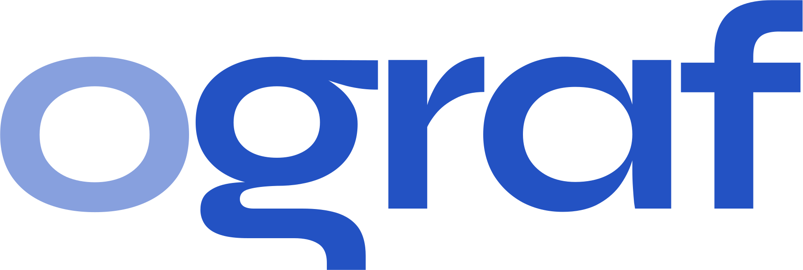
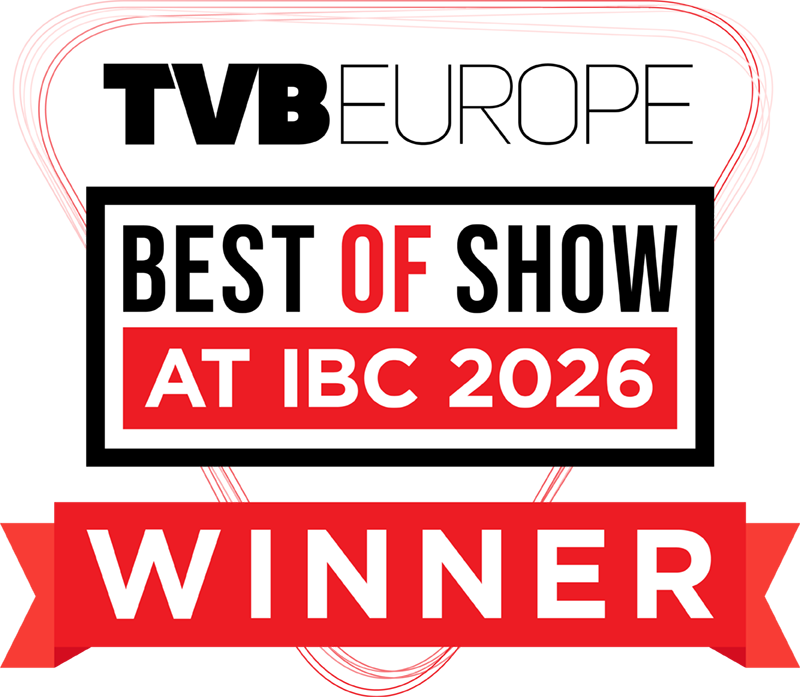

# <picture><source media="(prefers-color-scheme: dark)" srcset="apps/editor/src/assets/ebu-ograf-logo-mono-white.svg"></picture> Studio

<p align="center">
  
</p>

<p align="center"><strong>OGraf Studio won TVBEurope’s Best of Show Award at IBC 2026.</strong></p>

Create animated, data-driven broadcast graphics visually or with AI.

OGraf Studio is an open-source, browser-based editor for EBU OGraf-compatible HTML5 graphics:
lower thirds, scoreboards, tickers, full-screen graphics and reusable templates.

[Download the latest release](https://github.com/zerodensity/ograf-studio/releases/latest) ·
[Getting started](#get-started) · [Documentation](#documentation)


## Key features

- **Visual authoring** — Compose text, images, shapes, editable vector paths and Lottie animations
  in a dockable workspace with multi-monitor support.
- **Animation and effects** — Independent property tracks, easing, seamless loops, gradients,
  masks and composable effects.
- **Reusable designs** — Brand Kits, style packs, components and procedural patterns keep graphics
  consistent across a package.
- **Live data** — Bind text, images and colors to operator fields, with structured GDD objects,
  arrays and runtime collections.
- **AI with operator control** — Built-in AI chat and external MCP agents use revision-checked
  operations and visual review. The resulting layers and animation remain editable by the operator.
- **Portable OGraf output** — Export HTML5 packages with realtime playback and deterministic
  non-realtime seeking, checked before save and export.

## Get started

[Download a single-file server](https://github.com/zerodensity/ograf-studio/releases/latest) for
Windows x64 or Linux x64/ARM64. Run it and open **http://127.0.0.1:4318/**.
On Linux, first run `chmod +x <downloaded-file>`.
No Node.js, npm or Bun installation is needed. Platform verification and signing details accompany each release.

To run from source with Node.js 22+:

```sh
npm ci
npm run dev
```

Open **http://localhost:5173/**. See the [development guide](docs/DEVELOPMENT.md) for MCP setup,
building executables and verification.

## Documentation

- [Using Studio](docs/USER_GUIDE.md) — projects, images, SVG and Lottie.
- [AI authoring](docs/AI_AUTHORING.md) — built-in chat, MCP clients and the authoring skill.
- [What's new](docs/releases/0.22.0-rc.2.md) — 0.22 release-candidate highlights.
- [Contributing](CONTRIBUTING.md) — community development and verification.

Contributions target `dev`; maintainers promote tested changes into `stable`, the default branch.

Automated OGraf conformance checks are not EBU certification or a guarantee of compatibility with
every third-party player.

## License

[GNU Affero General Public License v3.0](LICENSE) (`AGPL-3.0-only`).

[Third-party asset credits](docs/THIRD_PARTY.md).
